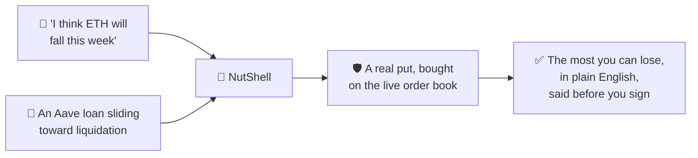
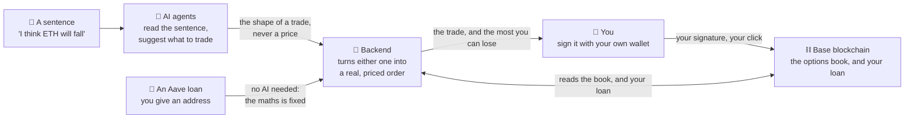

# 🥜 NutShell

**Options on [Thetanuts Finance V4](https://docs.thetanuts.finance), in a nutshell.**
Natural-language options trading, live on Base mainnet. Built for the MUBA Hackathon,
**Track 1: SDK Product** and **Track 2: AI × Options**.

**For someone who owns crypto but has never traded a derivative.** Say what you think will
happen and it finds a real option on the live book, explains it in plain English, and shows
the most you can lose before you sign anything. Hand it the address of an Aave loan instead
and it works out the put that would cover you, with no sentence to write at all.

It only ever buys, so your maximum loss is always exactly what you paid. Every number you see
comes from the live order book rather than from a language model, and nothing is signed
without your click. Real funds, real mainnet, tiny size: trades of 1 to 2 USDC are normal
here.

## Problem

Someone holding crypto who expects a fall has two moves: sell, or ride it down. Options are
the third, and almost nobody makes it, not because the idea is hard. Every options interface
opens with strikes, expiries and greeks, and none of them answer the only question a beginner
actually has: **if I'm wrong, what does this cost me?**

The fear behind that question is well founded. Options really can lose you more than you put
in, but only if you **sell** them. Buying one has a floor: the premium, and nothing past it.
Mainstream interfaces put the safe half and the dangerous half behind the same screen and
leave you to work out which one you are doing.

Borrowers face a sharper version, because the first move is not available to them at all.
Collateral deposited on Aave is locked, so a falling price is not something you can sell your
way out of. You watch the health factor slide toward a liquidation penalty and hope. A put is
the instrument that helps, but pricing one against your own loan means knowing your
liquidation price, choosing a strike above it, and sizing it against your debt: three pieces
of arithmetic before you have even opened an order book.

**NutShell is two doors onto the same thing.** Say what you think will happen, and it finds a
real order on the live Thetanuts book, explains it in plain English, and states the most you
can lose before you commit. Or hand it the address of an Aave loan, and it reads the position,
derives the liquidation price Aave itself would use, and prices the put that pays out in USDC
if the collateral falls past it. No sentence, no model, just arithmetic.



**It only ever buys.** That single constraint is what makes everything else honest: your
maximum loss is exactly the premium you paid, it is knowable before you sign, and the
interface can say so with no asterisk attached.

## Blockchain and contracts

**Base mainnet, chainId 8453.** There is no testnet deployment. Every order, price and fill
in this project is against live mainnet contracts. A real one, on chain:
[`0xddffd03b…56a680a0`](https://basescan.org/tx/0xddffd03b10e777805656e1573849042a903e5129d3125aa83c3bdd4256a680a0).

NutShell deploys no contracts of its own. Every address below belongs to a protocol it
integrates, and `npm run explore` prints the first two off the live chain.

| Contract | Address | Used for |
|---|---|---|
| Thetanuts OptionBook (Base_r12) | [`0x1bDff855d6811728acaDC00989e79143a2bdfDed`](https://basescan.org/address/0x1bDff855d6811728acaDC00989e79143a2bdfDed) | The resting order book. Every Fill |
| Thetanuts OptionFactory (Base_r12) | [`0x8118daD971dEbffB49B9280047659174128A8B94`](https://basescan.org/address/0x8118daD971dEbffB49B9280047659174128A8B94) | Sealed-bid RFQ. Every Cover, and custom strikes |
| Aave V3 PoolAddressesProvider | [`0xe20fCBdBfFC4Dd138cE8b2E6FBb6CB49777ad64D`](https://basescan.org/address/0xe20fCBdBfFC4Dd138cE8b2E6FBb6CB49777ad64D) | Reading a Borrower's Loan |
| aBasWETH | [`0xD4a0e0b9149BCee3C920d2E00b5dE09138fd8bb7`](https://basescan.org/address/0xD4a0e0b9149BCee3C920d2E00b5dE09138fd8bb7) | Aave receipt token; its balance **is** the WETH collateral |
| aBascbBTC | [`0xBdb9300b7CDE636d9cD4AFF00f6F009fFBBc8EE6`](https://basescan.org/address/0xBdb9300b7CDE636d9cD4AFF00f6F009fFBBc8EE6) | The same, for cbBTC collateral |
| USDC | [`0x833589fCD6eDb6E08f4c7C32D4f71b54bdA02913`](https://basescan.org/address/0x833589fCD6eDb6E08f4c7C32D4f71b54bdA02913) | Every premium paid, and every cash settlement |
| WETH | [`0x4200000000000000000000000000000000000006`](https://basescan.org/address/0x4200000000000000000000000000000000000006) | What an ETH call delivers; Aave collateral |
| WBTC | [`0x0555E30da8f98308EdB960aa94C0Db47230d2B9c`](https://basescan.org/address/0x0555E30da8f98308EdB960aa94C0Db47230d2B9c) | What a BTC call delivers |
| cbBTC | [`0xcbB7C0000aB88B473b1f5aFd9ef808440eed33Bf`](https://basescan.org/address/0xcbB7C0000aB88B473b1f5aFd9ef808440eed33Bf) | Aave collateral a Cover can hedge |

The two BTC tokens are not interchangeable and are never treated as such: WBTC is a payout
asset on the trading side, cbBTC is collateral on the Cover side.

The Aave Pool and price oracle are deliberately absent from that table: they are resolved
from the PoolAddressesProvider at runtime, because Aave upgrades the Pool behind that
registry and a hardcoded Pool address quietly stops being true. Confirmed 2026-09-02,
`getPool()` returns `0xA238Dd80C259a72e81d7e4664a9801593F98d1c5`.

An Underlying is identified by its Chainlink price feed rather than by its token (ADR-0010),
so these six addresses are what the book is keyed on. Read off the live book on 2026-09-01
and confirmed by strike range — no two ranges overlap, so no feed is ambiguous:

| Asset | Price feed |
|---|---|
| BTC | [`0x64c911996D3c6aC71f9b455B1E8E7266BcbD848F`](https://basescan.org/address/0x64c911996D3c6aC71f9b455B1E8E7266BcbD848F) |
| ETH | [`0x71041dddad3595F9CEd3DcCFBe3D1F4b0a16Bb70`](https://basescan.org/address/0x71041dddad3595F9CEd3DcCFBe3D1F4b0a16Bb70) |
| SOL | [`0x975043adBb80fc32276CbF9Bbcfd4A601a12462D`](https://basescan.org/address/0x975043adBb80fc32276CbF9Bbcfd4A601a12462D) |
| BNB | [`0x4b7836916781CAAfbb7Bd1E5FDd20ED544B453b1`](https://basescan.org/address/0x4b7836916781CAAfbb7Bd1E5FDd20ED544B453b1) |
| XRP | [`0x9f0C1dD78C4CBdF5b9cf923a549A201EdC676D34`](https://basescan.org/address/0x9f0C1dD78C4CBdF5b9cf923a549A201EdC676D34) |
| AVAX | [`0xE70f2D34Fd04046aaEC26a198A35dD8F2dF5cd92`](https://basescan.org/address/0xE70f2D34Fd04046aaEC26a198A35dD8F2dF5cd92) |

## Team

- Dennis Heng Shu Yi
- Ng Sean Sean
- Tan Zhen Yu
- Tang Shao Xian

## AI tool declaration

This project was built with AI assistance, and the parts it touched are stated rather than
implied. Claude Code (Anthropic) was used for implementation, refactoring, test authoring and
drafting the architecture decision records in `docs/adr/`. The architectural decisions
themselves, the domain model in `CONTEXT.md`, and the hard invariants in `CLAUDE.md` were
specified by the team, and generated code was reviewed before merge. The commit history
records AI co-authorship where it applies.

The product also uses AI at runtime, which is a separate thing. OpenAI, Groq and Anthropic
models extract a Trade Intent from a sentence and produce the Forecast analysis. No model
ever produces a number a Trader reads: every price and payoff is re-derived server-side from
the live order book after the model has selected an Order (ADR-0006).

## Setup

```bash
npm install
cp .env.example .env      # then fill in THETANUTS_RPC_URL
```

You need a Base RPC key (alchemy.com → create app → Base Mainnet). The public endpoint
throttles and the failures look like bugs in your own code.

Trading needs nothing else. The Forecast routes additionally need at least one of
`OPENAI_API_KEY`, `GROQ_API_KEY` or `ANTHROPIC_API_KEY` — they are tried in that order,
each falling through when its key is absent or its call fails. Without any of them the
rest of the app runs exactly as before; only `/forecast/*` refuses.

The four `/forecast/*` GET routes (`news`, `price`, `risk-benefit`, `indicators`) also need
`COPILOT_API_TOKEN` set — unlike every other route in this app, they refuse rather than
running unauthenticated, since a plain GET is forgeable cross-site even without a matching
CORS origin.

The Risk Profile / Suggestion / Decision routes need `SUPABASE_URL` and
`SUPABASE_SERVICE_ROLE_KEY` — already present, empty, in `.env.example`. Without them those
five routes 502. The schema for the two tables they use (`risk_profiles`, `decisions`) lives
in `supabase/migrations/` and must be applied to a fresh Supabase project before those
routes work.

```bash
npm run wallet -- new          # generate a disposable wallet; fund it ON BASE
npm run wallet                 # check it received USDC (to trade) and ETH (for gas)
npm run dev                    # start the API on :3001
npm run explore                # read-only. No wallet needed. Verifies the connection.
npm run fill                   # dry run: previews a real order, signs nothing
npm run fill -- --live         # SPENDS REAL USDC on Base mainnet
npm run web                    # the trading surface on :3000 (needs the API up)
npm run forecast -- ETH 7d     # the opinion surface. Costs a real AI API call
npm run agents                 # the Python agents service on :8000. Needs the venv below
npm run nlp -- "protect my ETH for 2 days with $20"   # intent extraction. No RPC needed
```

The agents service needs its own environment once, and `apps/agents/README.md` has the
detail: `cd apps/agents && python -m venv .venv`, activate it, then
`pip install -r requirements.txt`. Only `GET /forecast/indicators` and `GET /suggestion`
depend on it; everything else runs without it.

```bash
npm run test:unit              # Vitest. Seconds, no browser
npm run test:node              # the Forecast suites, under `tsx --test`
npm run test:py                # pytest, against the venv in apps/agents/.venv
npm run test:e2e               # Playwright + axe against the built app
npm test                       # all four
```

Two test runners, which is a merge artefact rather than a preference: the Forecast
suites are written against `node:test`, everything else against Vitest. The root
`vitest.config.ts` excludes the former so they are run rather than silently collected
and failed, and CI has a step for each — a suite that is green by never having run is
worse than no suite.

The browser suite needs Chromium once: `npx playwright install chromium`. It stubs the API
from `apps/web/tests/fixtures/`, generated by the real Fastify app — so a contract change
fails `web-fixtures.test.ts` with an instruction rather than leaving the browser tests
passing against a fiction. Regenerate with `npm run fixtures`. `tests/insights.spec.ts` walks
the Insights tab, and `tests/stub.ts` stubs `/risk-profile`, `/suggestion` and `/decisions`
alongside the rest.

For a wallet: `npm i -g @thetanuts-finance/cli && thetanuts wallet create`. Use a **disposable**
one and fund it with ~3 USDC plus a few cents of ETH for gas.

## Architecture



**Two ways in, one way out.** Either you say what you think will happen, or you hand over the
address of an Aave loan you want protected. Both end at the same place: a real option, priced
off the live book, with the most you could lose written on it before you commit.

The first door goes through the **AI agents**. One reads your sentence into "buy a put on
ETH, about a week out", another watches the market and suggests a trade before you've asked,
and a third can veto one. The second door doesn't need them at all, because a loan has a
liquidation price, and the option that covers it follows from arithmetic, not opinion.

The **backend** is the only part that understands options, and the only part that talks to
the chain. The **blockchain** is where the money actually is: the backend only ever *prepares*
a transaction, and your own wallet is what signs and sends it. Nothing is ever signed without
your click, on the loan side included, where it would be easiest to quietly automate.

The line that matters is between the AI and the money. An agent may **name** a trade (this
asset, roughly this strike, roughly this expiry) but it may never produce a number you read.
Every price, payoff and Max Loss is re-derived by the backend from the live order book after
the AI has spoken, so a model that hallucinates a price changes nothing you see. A separate
AI writes market commentary, and it is kept structurally away from the trading screens for
the same reason.

See **[CONTEXT-MAP.md](./CONTEXT-MAP.md)** for the two things this app does (trading, and
protecting an existing loan), **[CONTEXT.md](./CONTEXT.md)** for the vocabulary, and
[Design](#design) below for why each boundary is where it is.

## Tech stack

| Layer | What we use | Why |
|---|---|---|
| Frontend | Next.js 15, React 19, TypeScript | The surface. No SDK, no key, no arithmetic: it renders strings the server already formatted |
| Wallet | wagmi + viem, EIP-6963, WalletConnect | Many wallets, picked by the Trader, not one assumed `window.ethereum` (ADR-0011) |
| Backend | Fastify 5, TypeScript, zod | The only process holding a key. zod schemas are shared with the frontend, so the contract is one file |
| Options | Thetanuts client SDK v0.3, ethers v6 | The live order book on Base, and the signing/calldata primitives |
| Lending | Aave V3 on Base, read via ethers | A Borrower's real loan and its real liquidation price (ADR-0015) |
| Agents | Python, FastAPI, pandas, pydantic | Indicators and Suggestions, on loopback only. Reaches the chain solely through the Node backend (ADR-0007) |
| AI | OpenAI, Groq, Anthropic, tried in that order | Reads a sentence, drafts an opinion. Never originates a number (ADR-0006) |
| Data | Supabase (Postgres) | Accounts, Risk Profiles, Decisions, open RFQs. Never balances, because the chain owns money (ADR-0003) |
| Tests | Vitest, `node:test`, pytest, Playwright + axe | Four suites, all on every push |

TypeScript everywhere except the agents, which are Python because that is where the
indicator and backtesting libraries live. Groq is reached through the OpenAI SDK with a
swapped base URL, so three providers cost two clients.

## Design

The reasoning behind this project is written down, not assumed:

- **[CONTEXT-MAP.md](./CONTEXT-MAP.md)** — the two contexts: the Copilot, and Liquidation Cover.
- **[CONTEXT.md](./CONTEXT.md)** — the glossary. What a Trader, a Fill, a Max Loss, a Forecast is.
- **[docs/adr/](./docs/adr/)** — the decisions and why they went that way:
  - [0001](./docs/adr/0001-the-model-never-touches-money.md) — the model never picks an order and never produces a number
  - [0002](./docs/adr/0002-buy-only.md) — buy-only, because it makes Max Loss exact
  - [0003](./docs/adr/0003-chain-is-the-source-of-truth-for-money.md) — the chain owns money, the DB owns the conversation
  - [0004](./docs/adr/0004-nextjs-frontend-node-backend.md) — the stack, and why not Python
  - [0005](./docs/adr/0005-forecasts-are-quarantined-from-the-trade-flow.md) — opinions never sit next to guarantees
  - [0006](./docs/adr/0006-the-agent-selects-the-order-code-derives-every-number.md) — the agent picks the Order, code derives every number (supersedes 0001)
  - [0007](./docs/adr/0007-agents-are-a-python-service-behind-the-node-backend.md) — the agents are Python, behind the Node backend (supersedes half of 0004)
  - [0008](./docs/adr/0008-cover-is-bought-by-rfq-for-single-collateral-loans-only.md) — Cover is RFQ-only, single-collateral Loans only
  - [0011](./docs/adr/0011-non-custodial-fill-for-multi-tenant-wallets.md) — each Trader signs their own fill; the backend prepares, never signs
  - [0012](./docs/adr/0012-wallet-proof-sessions-and-chain-verified-settle.md) — sessions prove wallet ownership before a fill; the chain decides whether a fill succeeded
  - [0013](./docs/adr/0013-a-risk-profile-belongs-to-a-wallet.md) — a Risk Profile is keyed on the proven wallet, not a browser-minted id (superseded by 0018)
  - [0014](./docs/adr/0014-sign-in-required-before-wallet-connect.md) — a real account is required before wallet-connect or Confirm; Deck browsing and Practice Run stay open
  - [0015](./docs/adr/0015-the-liquidation-price-is-aaves-and-disagreeing-sources-refuse.md) — the Liquidation Price is Aave's, and two disagreeing price sources refuse rather than pick
  - [0016](./docs/adr/0016-cover-is-partial-and-says-by-how-much.md) — a Cover says how much of the Loan it actually covers
  - [0017](./docs/adr/0017-the-rfq-money-path-is-two-signatures-with-a-wait-between-them.md) — an RFQ is two signatures with a wait between them, and no price until a maker answers
  - [0018](./docs/adr/0018-a-risk-profile-belongs-to-an-account.md) — a Risk Profile is keyed on the signed-in account, not the wallet (supersedes 0013)
